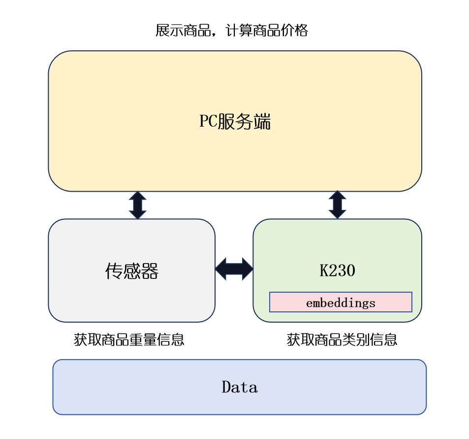
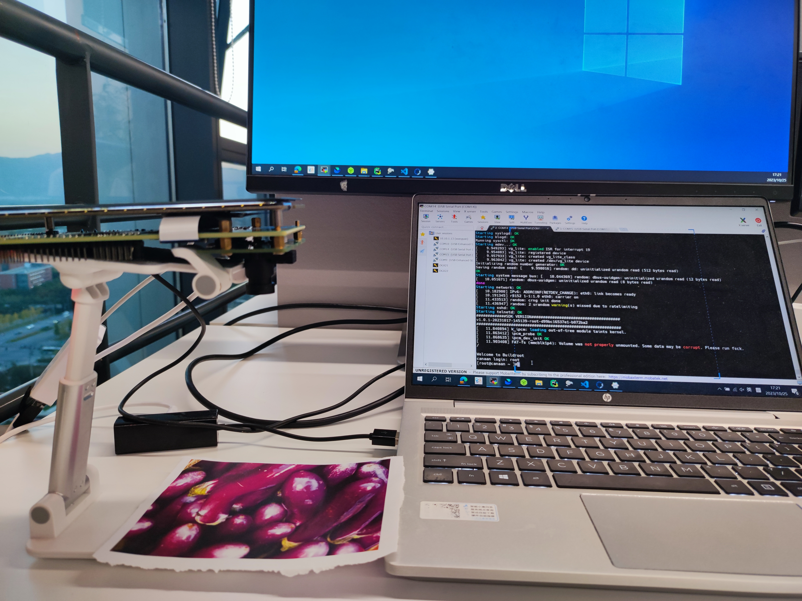
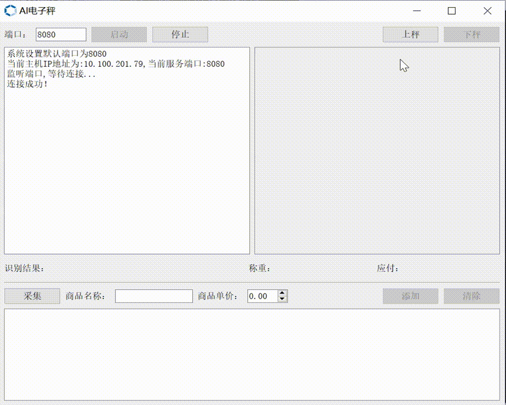

# K230 模拟AI电子秤

Document version: V1.0 Release date: 2023-10-26

## 介绍
该项目为K230 模拟AI电子秤开源工程。本工程基于K230应用了度量学习技术实现商品识别。本应用使用PC作为服务端控制上秤、下秤、采集新商品和展示称重商品；使用K230作为客户端建立对比向量库，然后捕捉图像进行向量相似度对比获得商品类别，结合商品单价和商品重量得到应付钱数；最后将商品类别和应付钱数在PC端展示给用户。



本项目主要侧重于K230端功能的实现，使用PC端的“上秤”，“下秤”两个按钮模拟传感器的逻辑。多次点击采集按钮获取开发板摄像头采集的新类别图片；点击添加按钮将新类别添加到底库中；点击清除按钮停止采集。本项目未连接重量传感器，设置默认重量为1kg。

## 主要特点

- 实时自学习：无需重新训练模型，使用采集功能在底库数据集中添加对应类别，推理时即可识别；


- 小样本分类效果良好：每个类别只需要几张图片即可完成分类；

## 环境准备

    #######download.sh########
    for file in AIScale.zip;  
    do  
    wget https://ai.b-bug.org/k230/downloads/fancy_poc/ai_scale/$file || wget https://kendryte-download.canaan-creative.com/k230/downloads/fancy_poc/ai_scale/$file;  
    done  
    
    for file in onboard_v2.5.zip
    do
    wget https://ai.b-bug.org/k230/downloads/fancy_poc/ai_scale/k230_board/$file || wget https://kendryte-download.canaan-creative.com/k230/downloads/fancy_poc/ai_scale/k230_board/$file;  
    done

## 数据准备

待分类的数据必须要按照固定格式进行组织，数据组织形式如下：

```
|-gallery
	|-0
	   |-0.jpg
	   |-1.jpg
	   |-2.jpg
	   |-...
	   |-label.txt
	|-1
	   |-0.jpg
	   |-1.jpg
	   |-...
	   |label.txt
	|-2
	   |-...
	|...
```

数据集的根目录为gallery，gallery包含若干个子文件夹，每个文件夹以类别编号命名，从0开始；类别文件夹下包括若干张图片(图片不要太大，不超过300kb)和一个label.txt文件，图片从0开始命名，label.txt文件中第一行存储类别名称，第二行存储类别单价，如gallery/0/label.txt：

```shell
长茄子
1.23
```

该数据集用于在商品识别之前创建底库。

本项目提供了示例商品类别底库，请参照onboard_v2.5/gallery中的数据结构组织数据。

## 可执行文件编译

进入SDK目录下的reference/fancy_poc下，执行：

```shell
chmod +x build_app.sh
./build_app.sh
```

在reference/fancy_poc/k230_bin目录下，获取ai_scale.elf和client拷贝到开发板onboard_v2.5内。

## 服务端准备

### 1.准备服务端运行环境

    #解压AIScale.zip即可


## 客户端准备

### 1. 源码编译

在k230 docker中在src/reference/ai_poc目录下执行./build_app.sh，得到编译后的 ai_scale.elf以及client

### 2.在k230上创建ai_scale工程

    ## 进入大小核共享文件夹/sharefs
    cd /sharefs
    mkdir ai_scale
    ##将需要的文件拷贝到ai_scale目录下，如编译的ai_scale.elf、client、对应的kmodel、底库数据gallery等文件

## 程序运行

### 1. 服务端：

    # 解压AIScale.zip
    cd AIScale
    start AIScale.exe #或双击AIScale.exe启动

**注意：**服务端界面启动后点击**启动**按钮， 服务端服务IP为运行服务器的本机IP，连接端口默认为8080，连接端口可自定义。

### 2. K230客户端

服务端启动后，会在日志框中显示待连接的ip和端口，小核连接时

    cd /sharefs/ai_scale
    #小核下执行（IP和端口由服务端设置）
    ./connect.sh 192.168.1.2 8080
    #大核下执行（./ai_scale_isp.sh）
    ./ai_scale.elf recognition.kmodel None gallery 5 1
    #gallery是底库数据集的路径

**注意：** 1、使用./connect.sh命令时需要使用服务端显示的相应IP地址及通信端口；

​	     2、PC和开发板IP需在同一网段下；

​	     3、启动时，先启动服务端，再启动小核程序，最后启动大核程序；结束时，先终止大核程序，再停止小核程序，最后关闭服务端界面；


## 结果展示

### 测试说明图



PC启动服务端，开发板摄像头对准识别商品，调整开发板使得摄像头拍摄到的图像尽可能清晰且距离固定。然后建立PC和开发板之间的连接，开始上秤识别。

### 服务端展示界面


### k230屏幕显示和服务器端显示



- 本项目依赖网络传输，图片的传输和处理较慢，不可频繁多次点击同一按钮，如有问题，可重新启动；

- 本项目侧重实现K230端的商品识别称重计价；

  
