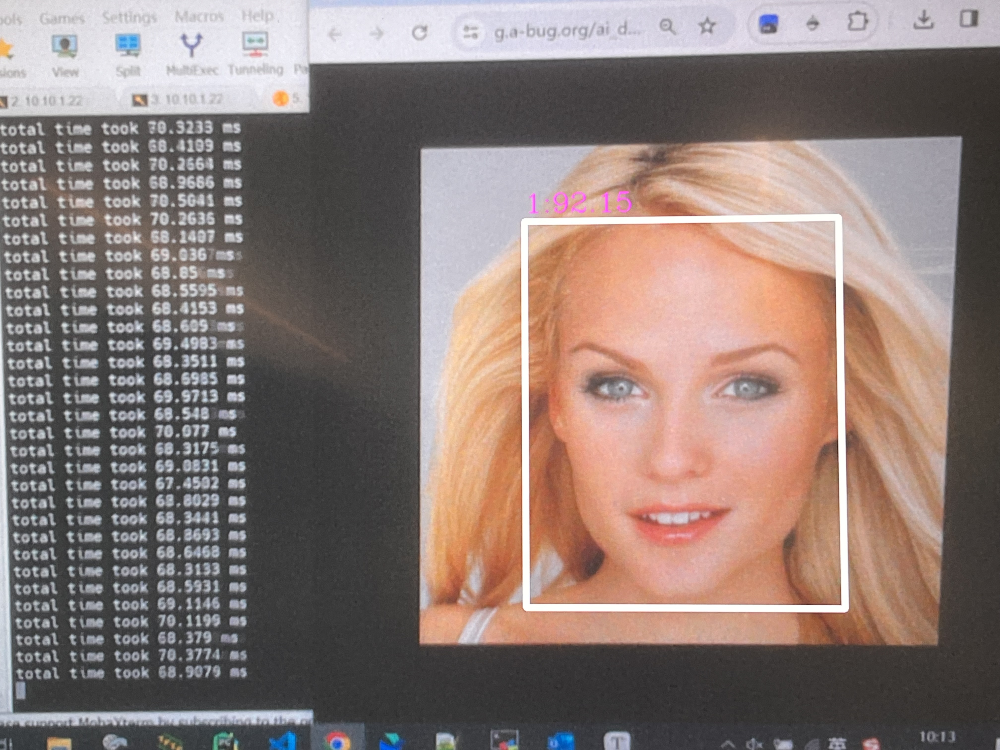

# K230 人脸识别POC

Document version: V1.0 Release date: 2023-12-22

## 介绍
该项目为K230人脸识别POC开源工程。本工程基于K230开发，采用深度学习技术实现了强大的人脸识别功能。该应用涵盖了两个关键流程：人脸注册和人脸识别。在人脸注册阶段，用户可以通过PC端的人脸注册工具构建人脸数据库，为系统提供训练数据。随后，用户将构建好的人脸数据库拷贝到K230开发板上。通过专门设计的人脸识别程序，系统将实时捕捉到的人脸特征与底库进行对比，从而判断当前帧人脸是否被系统认识。

该开源工程的主要目的在于协助用户利用K230平台的强大功能和性能，快速搭建一个可靠、高效的人脸识别系统。通过这一系统，用户能够便捷地进行人脸的注册和识别，应用于门禁系统、考勤系统、智能安防等多个领域。

## 主要特点

- 快速高效 ：人脸识别模型backbone为resnet50，k230大核可以实现实时人脸识别推理


- 操作简单：提供人脸注册工具，一行命令构建人脸数据库

## 环境准备
    #######download.sh########
    for file in K230_Tools_for_face_embedding.zip;
    do  
    wget https://ai.b-bug.org/k230/downloads/fancy_poc/face_recognition/$file || wget https://kendryte-download.canaan-creative.com/k230/downloads/fancy_poc/face_recognition/$file;  
    done 
    
    for file in onboard_v2.8.3.zip
    do
    wget https://ai.b-bug.org/k230/downloads/fancy_poc/face_recognition/k230_board/$file || wget https://kendryte-download.canaan-creative.com/k230/downloads/fancy_poc/face_recognition/k230_board/$file;  
    done


## 人脸注册准备

### 1.准备人脸注册工具

    #（1）在pc上解压K230_Tools_for_face_embedding.zip即可

## 2.人脸识别准备

### 1. 源码编译

在k230 docker中在src/reference/fancy_poc目录下执行./build_app.sh，编译后得到face_recognition.elf

### 2.在k230上创建face_recognition工程

    # （1）运行download.sh下载对应的kmodel等文件
    # （2）cd到/sharefs目录
    cd /sharefs
    # （3）创建face_recognition目录
    mkdir face_recognition
    # （4）将需要的文件拷贝到face_recognition目录下，如编译的face_recognition.elf、download.sh下载的kmodel等文件

**注意：** sharefs下的文件结构可以参考download下载的onboard文件夹内文件

## 程序运行

### 1. PC端人脸注册

人脸特征提取工具是提取人脸特征的工具，用于从图像提取人脸的特征，为人脸识别提供数据库。

**a.使用说明**

| 参数             | 参数说明                                                     |
| ---------------- | ------------------------------------------------------------ |
| --img_dir        | **[必选]**  注册人脸目录，对目录中的人脸进行注册；注册时**图片名称**即注册人脸的名字；图片格式**仅支持png、jpg** |
| --db_dir         | **[必选]**  数据库目录，存放注册的人脸特征；目录不存在，会自动创建 |
| --det_resolution | **[可选]** 人脸检测分辨率，可选项320、640，默认640           |
| --det_conf       | **[可选]** 人脸检测阈值，默认0.8                             |
| --pitch          | **[可选]** 人脸姿态估计偏航角,抬/低头角度，默认30            |
| --yaw            | **[必选]** 人脸姿态估计偏航角,摇头角度，默认30               |
| --roll           | **[可选]** 人脸姿态估计滚转角,转头角度，默认30               |
| --append_db      | **[可选]**  是否**追加**数据库；若数据库已存在注册人脸，想要追加新的人脸，选择True。若**重建**数据库或**新建**数据库，选择False。默认为False |

**b.使用示例：**

将该图片放到C:\lj\img下，并创建C:\lj\db目录


```plaintext
示例一：
Main.exe --img_dir C:\lj\img --db_dir C:\lj\db
示例二：
Main.exe --det_resolution 320 --img_dir C:\lj\img --db_dir C:\lj\db
```

**c.运行效果：**


**d.数据库目录结构：**


### 2. k230端人脸识别

**a.使用说明：**

- 按“q+Enter”键退出

```plaintext
Usage: ./face_recognition.elf<kmodel_det> <det_thres> <nms_thres> <kmodel_recg> <max_register_face> <recg_thres> <input_mode> <debug_mode> <db_dir>
Options:
  kmodel_det               人脸检测kmodel路径
  det_thres                人脸检测阈值
  nms_thres                人脸检测nms阈值
  kmodel_recg              人脸识别kmodel路径
  max_register_face        人脸识别数据库最大容量
  recg_thres               人脸识别阈值
  input_mode               本地图片(图片路径)/ 摄像头(None)
  debug_mode               是否需要调试，0、1、2分别表示不调试、简单调试、详细调试
  db_dir                   数据库目录
```

**b.使用示例：**

```
#（1）大核下cd到人脸识别目录
cd /sharefs/face_recognition
#（2）将pc端注册成功的人脸数据库success拷贝到当前目录
#（3）大核下执行（./exec_face_recognition.sh）
./face_recognition.elf face_detection_320.kmodel 0.6 0.2 face_recognition.kmodel 100 75 None 0 success
```

**c.效果展示：**


