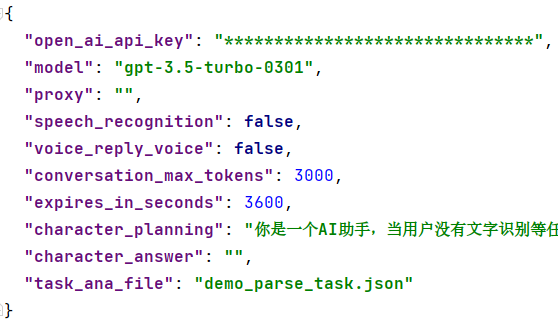
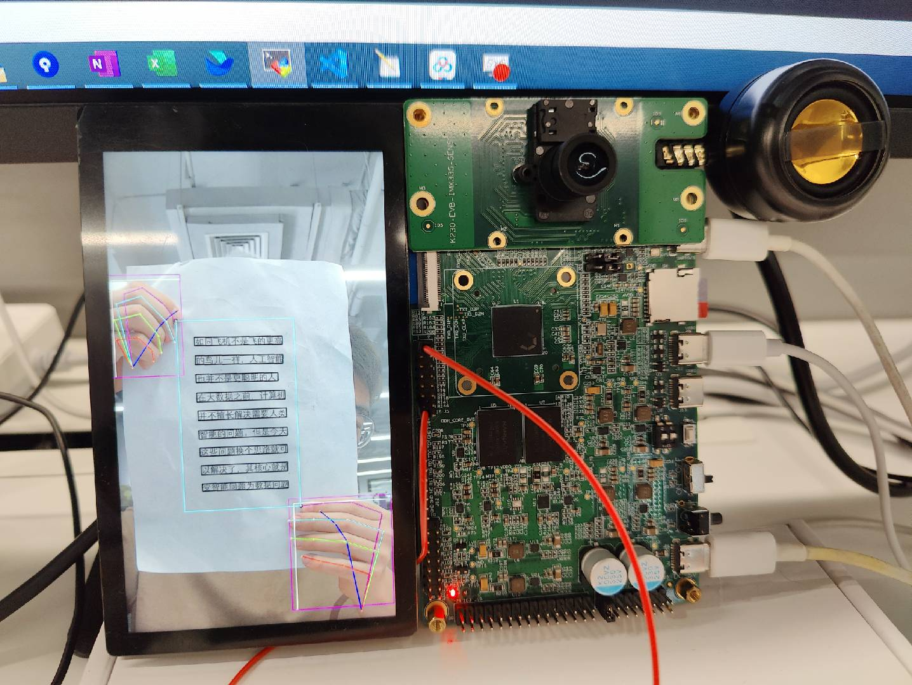
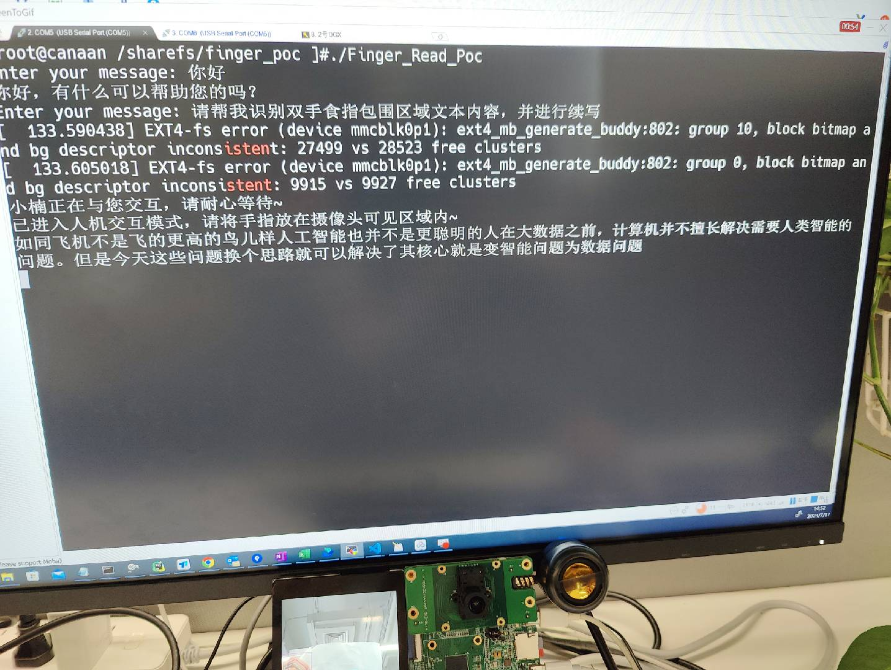

## K230 指读POC

Document version: V1.0 Release date: 2023-8-31

## 介绍

该项目为指读POC的开源工程，本工程基于chatgpt、pytorch融合了文本内容交互、手指关键点检测、文本续写、文本转语音等多项技术。能够让用户在k230计算资源上轻松的与chatgpt进行交互，通过与chatgpt聊天实现指读续写功能。

### 主要特点

* chatgpt文本交互

​		支持用户在k230小核端正常与chatgpt文字聊天

* chatgpt任务理解

​		当用户发送'帮我识别双手食指/中指/无名指包围区域文本内容'、'帮我识别左手食指、右手无名指包围区域文本内容'等含有指读聊天内容时，k230会进入AI指		读模式。

* 手指关键点检测

​		在指读模式下用户将手指与文本内容放置于摄像头下，当用户双手稳定出现在摄像头下时，即可启动手指关键点识别，用户双手关键点将被绘制在屏幕上

* ocr文本定位

​		k230大核AI端会对用户指定的手指包围区域进行ocr文本定位，选取中指定ROI中的文本片段

* ocr文本识别

​		k230大核AI端会对文本进行OCR识别，得到OCR文本内容

* chatgpt文本续写

​		得到的文本内容会通过socket发送给chatgpt服务机器人进行续写

* 文本转语音

  最终得到的续写内容会经过TTS Model做文本转语音操作，最后得到的音频数据会在k230小核端播放。
  
  

## 服务端准备

### 1. 下载服务端源码

- 将src目录下的finger_reader_server目录下载到本地

### 2.在准备服务端运行环境

* conda create -n finger_read python=3.8
* cd Finger_Reader_Server
* pip install requirements.txt

### 3. 配置openai api key

* cd Finger_Reader_Server
* 打开config.json，输入openai api key

### 4. 启动服务

* 在Finger_Reader_Server目录下执行python app.py即可开启服务端程序

**注意：**服务端服务ip为运行服务器的本地ip，连接端口默认为8000，如果需要更改的话请在channel/Client_Server/Client_Server_Poc.py中的startup函数中进行更改

## 客户端准备

* 在k230 docker中进入到/mnt/src/reference/fancy_poc/目录下，
* 然后执行./build_app.sh，将会在/mnt/src/reference/fancy_poc/k230_bin/目录下生成相应的可执行文件**Finger_Read_Poc**和**ocr_poc.elf**
* 运行src下的download.sh，下载**kmodel**及**dict_6625.txt**字典文件
* 进入到开发板环境后将/dev/mmcblk0p1（linux文件系统）挂载到/sharefs下
* 在k230开发板的sharefs目录下创建finger_reader目录mkdir finger_reader
* 拷贝**Finger_Read_Poc**、**ocr_poc.elf**、**kmodel**、**dict_6625.txt**以及src/utils中的**run.sh**脚本到k230开发板sharefs/finger_reader目录下
* 在finger_reader目录下创建临时文件，执行touch received_image.jpg、touch audio.wav、touch param.txt、touch ocr.txt

芯片端所使用的文件具体可参考download.sh 脚本下载的onboard文件夹内容(可以用编译出来的**Finger_Read_Poc**、**ocr_poc.elf**替换onboard内容使用)

## 程序运行

### 1. 服务端：

* cd Finger_Reader_Server
* conda activate finger_read
* python app.py

### 2. K230客户端

* cd /sharefs/finger_reader
* 大核下执行./ocr_poc.elf
* 小核下执行sh run.sh

**注意：** 需要在run.sh中配置响应的通讯端口及ip，或者直接在小核下执行Finger_Read_Poc < Port > <Ip_address> 如：Finger_Read_Poc 8080 192.168.1.1

**注意：** 本应用仅提供一个示例实现，如需更高精度或更优体验，可通过调整阈值或自行替换相应的模型文件。