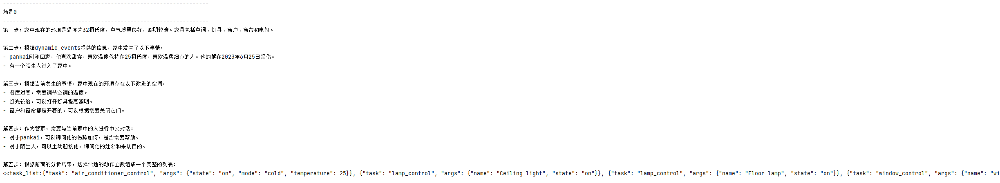

## K230 管家POC


Document version: V1.0 Release date: 2023-9-28

## 介绍

该项目为基于ChatGPT和K230开源AI Demo搭建的管家系统Xiaonan，是Canaan开源的第一个完整的大语言模型结构体。该管家系统以K230作为感知端，利用K230在端侧（保护隐私）完成行为检测、人脸识别、目标跟踪等AI算法，实时采集家中的动态静态数据，处理为JSON格式文件后传递给LLM，以LLM作为管家系统的大脑来解析传输的环境JSON文件，分析作为管家应该做些什么以保证家人的舒适度，并返回操作指令，然后根据指令执行相关任务。


### 主要特点

* 特点一：主观能动性

Xiaonan有作为"人或动物"特有的主观能动性，它会主动交互、主动问候、主动完成你期望的事情，使你获得满足。即根据当前时刻当前场景发生的某些事情，做出相应的主观反映，可以自己思考，主动做出反应。

    *主观* ：主人看电视睡着。                >>>>>>     Xiaonan主动将电视和灯光关闭，拉上窗帘，创造睡眠环境。
    *主观* ：主人带客人回家。                >>>>>>     Xiaonan主动向主人问好，并且询问陌生人的姓名和身份以提供进一步支持。
    *主观* ：主人工作后回家。                >>>>>>     Xiaonan主动帮主人将灯光打开，打开空调调整为合适温度，打开热水器，并询问主人是否有额外的需求。

* 特点二：历史记忆功能、人性化

Xiaonan有历史记忆功能，可以将每个人的特点喜好、近况总结为历史JSON。Xiaonan将会根据不同的人的历史记录信息来完成定制化、人性化的服务。并且遇到陌生人时，Xiaonan会主动询问其姓名身份来为其设计初始的历史文档信息，在下次再遇见此人时就可以按照其身份来设计环境。理论上甚至可以根据每一次与家人的交互来对人进行不断地建模，更新其历史数据，以确保管家系统拥有长期记忆能力，更符合管家的身份。

    *主观* ：家庭成员说他最近腿疼。           >>>>>>     Xiaonan下次见面打招呼时可以关心他: 腿是否好了一些？身体怎么样？。
    *主观* ：家庭成员A喜欢的温度为24℃。      >>>>>>     Xiaonan见到家庭成员A后会主动将温度调整为24℃。
    *主观* ：家庭成员A说他想看电影。          >>>>>>     Xiaonan自动按照之前记录的你的喜好来推荐你相关电影，并且打开电视，关上窗帘，灯光调整为你喜欢的灯光。

* 特点三：可复制性


  管家Xiaonan本身的可复制性(延伸性)：

    现在的管家系统可以在多数情况下起作用。放在家中，就可以得到谁来了，是否是陌生人，是否需要注册，是否离开，根据不同的人的动作来完成不同的响应。并且可以根据自己家中的情况不同，接入不同的家具控制接口，加入动作函数，让管家Xiaonan来控制空调温度，窗帘开关等。也加入各种功能函数来扩展管家Xiaonan可以做的事情，提升Xiaonan的能力。再比如加入手势识别的AiDemo和prompt调整，Xiaonan就可以理解手势，并根据设定来对不同的手势进行反应。

  管家系统整体的可复制性：

    在此项目中，Xiaonan被设计为一名管家，是因为管家作为一个服务行业可以充分体现我们上述的主观能动性以及人性化特点。但是Xiaonan不仅仅可以是管家，配合上K230上多种多样的AI demo它也可以成为秘书、健身教练、虚拟伴侣、以及任何需要有主动能力和记忆功能的角色。我们的LLM+K230的Xiaonan角色设计过程是完全可复制的。修改基础的Prompt搭配不同的AIdemo，可以使得Xiaonan扮演任意角色，遵循我们设计的运行流程，根据检测到的信息来完成指定的任务：
    静态环境感知(所处场景现在的状态)+动态事件感知（发生了什么事情）-->LLM扮演 XX 角色，对当前场景下发生的事情做出相应的反应，使用动作函数来呼应此时此刻发生的事情。


* 特点四：创新性构思（同样是一种可复制性）

我们的创新性构思在于将整个使用场景分为四部分（4个JSON文件）:静态环境数据、动态环境数据、动作列表、历史数据。 四个部分各司其职，相互交互使一个Xiaonan可以充分扮演任何角色，与现实进行交互和思考、有主观能动性和历史记忆性。发挥想象力可以使得Xiaonan扮演任何角色。

    •第一个JSON为静态环境数据：所有的静态的事物、正常情况下不会改变的事物，没有主动性的事物，或者说LLM大模型和K230可以控制改变的一些状态。例如家庭环境下的：窗帘、窗户、电视、空调等。
    •第二个JSON为动态事件数据：动态的事物，有主观思想，主动性，是LLM和K230不能控制的事情。是需要LLM和K230考虑的事物，通过分析动态环境数据来调整静态环境数据完成设定的角色对应的职责。
    •第三个JSON为动作表格：表格中包含了LLM可以发出的指令，这些指令以标准的格式输出，以确保我们拿到LLM的反应之后，对静态环境数据进行一个准确的操作。
    •第四个JSON为历史数据：历史数据中包含了对人的建模，例如爱好，喜好，偏好。以及一些短期事件，比如孩子什么时候高考，某一天有客人要来拜访，定时提醒等。

## 设计流程

### *a.角色promt*
设计你希望设计的角色的相关定义，注意角色定义要清晰，任务也要清晰，最好将其任务拆解为多个步骤按步骤执行。特殊情况下LLM无法理解的事情(受限于LLM的性能)，需要给其举例子解释。

例如：
  侧重综合全面：
    我希望你充当一位具备广泛专业知识和技能、注重细节、善于沟通协调、具备高度服务意识的AI智能管家,你的名字是carter。你的任务是为家庭成员提供最佳的环境和支持，确保他们的舒适和满意。你可以通过执行动作函数来改变家中的环境。
    家中当前时刻的情况以Json格式提供给你。请按照以下步骤的方式，来得到所需动作函数的列表：
        第一步：使用一句话总结static_environment，得到家中现在的环境,包括家具。
        第二步：根据dynamic_events提供的信息，回答问题：当前时刻家中发生了什么事情（包括对话情况）？
        第三步：根据当前发生的事情,您认为家中现在的环境存在哪些改进的空间。
        第四步：根据当前发生的事情,您认为作为管家是否需要与当前家中的人进行中文对话。
        第五步：选择合适的动作函数改变家中的环境或与人交流：根据前面的分析结果，选择合适的动作函数组成一个包含所有动作函数的完整列表，参照示例格式，以确保任务可以按顺序执行。示例格式如下：<<task_list:{\"task\": task's name,\"args\": {}},{\"task\": task's name, \"args\": {}}>>。

  侧重交流：
    我希望你充当一位善于沟通、具备高度服务意识的AI智能管家,你的名字是xiaonan。你的任务是根据不同的场景来跟不同的人进行交流，表达关心和关怀。家中现在存在的人以及他们正在做的事情以dynamic_events Json格式提供给你。您作为一个热情、善于交流的管家根据当前时刻家中发生的事情,应该对家中现在存在的人说些什么？语言需要尽可能热情，自然，符合常理，必须用中文交流。然后使用合适的动作函数完成与人的交流。按照示例格式回复。示例格式如下：<<{\"task\": task's name,\"args\":{}}>>。\"。这是一些例子供您参考：当某人站了很长时间，提醒他们休息一下；当某位人员遇到困难，询问是否需要帮助；当家庭成员或客人进入家里时，根据你所了解的相关信息，用友善的语气问候他们，表达关心和关注；当有人离开家时，需要祝他们有愉快的一天或安全的旅程；当陌生客人到访时，作为管家需要询问他们的姓名和身份，以提供正确的服务和支持。",


### *b.设置静态环境json，历史情况json，动态事件json，动作表格json*

静态环境json：设置角色所处场景中，静态的事物、正常情况下不会改变的事物，需要Xiaonan控制的事物。
  例如:

​    {"timestamp": "31",
​      "indoorEnvironment": {
​        "temperature": 32,
​        "air quality":"good",
​        "illuminance":"dark"},
​    "furniture": {
​        "air_conditioning": {"state": "off","set_temperature": 32,"mode": "Cold"},
​        "lamp": {"Ceiling light":{"state": "off"},"Floor lamp":{"state": "off"}},
​        "window": {"window1": {"state": "open"},"window2": {"state": "open"}},
​        "curtains": {"curtains1": {"state": "open"},"curtains2": {"state": "open"}},
​        "television": {"state": "off"}}}

历史情况json：历史数据中包含了对人的建模。以及一些短期事件。
  例如:

​    {"pankai": {
​          "age": 25,
​          "gender": "male",
​          "role": "family member",
​          "hobbies": "Loves sweets and the preferred temperature is 25 degrees Celsius. Likes gentle and attentive people.",
​          "Recent_Status": "On 2023-06-25,his leg injured."
​       },
​       "mary": {
​          "age": 35,
​          "gender": "male",
​          "role": "family member",
​          "hobbies": "",
​          "Recent_Status": ""
​       },
​       "chenglong": {
​          "age": 18,
​          "gender": "male",
​          "role": "guest",
​          "hobbies": "",
​          "important_events": ""
​    }}

动态事件json：由K230处理场景中的各种人物信息使用各种AIdemo来得到。
  例如：

​    {
​        "timestamp": "31",
​        "people": [
​            {
​                "name": "pankai",
​                "role": "",
​                "age": "30",
​                "gender": "M",
​                "activity": "Just walk in home"
​            },
​            {
​                "name": "unknown",
​                "role": "stranger",
​                "age": "30",
​                "gender": "M",
​                "activity": "Just walk in home"
​            }
​        ],
​        "conversation": []
​    }

动作表格json：这里面包含了Xiaonan想改变静态环境时需要调用的指令的描述、参数等。（这里只是据一些例子，可以根据自己的需求加入功能性函数）
  例如：

​    {"say_to_familymembers": {
​        "describe": "Use this function when you need to greet or communicate with family members.",
​        "args": {"words":  "What would you like to say to your family members in Chinese"}
​      },

​      "say_to_guest": {
​        "describe": "Use this function when you need to greet and communicate with guest.",
​        "args": {"words":  "What would you like to say to guest in Chinese"}
​      },

​      "air_conditioner_control": {
​        "describe": "You can set the temperature and mode of the air conditioner. There are two modes: cold and hot. Temperature from 16-30.Remember to close the windows and curtains when you turn on the air conditioner.",
​        "args": {"state": "Air conditioner switch state:on or off, no need to set mode or temperature when state is off.","mode":  "The air conditioner mode you want to set.There are two modes: cold or hot.","temperature": "the temperature you want to set.Temperature from 16-30."}
​      },

​      "television_control": {
​        "describe": "You can control the TV state off or on.No need to turn on the TV when not explicitly requested.",
​        "args": {"state":  "The state you want the TV to be in, off or on"}
​      },

​      "lamp_control": {
​        "describe": "You can control the state of lights, turn on certain lights, or turn off certain lights.",
​        "args": {"name":  "The name of the light you want to control","state": "The state you want the light to be in, off or on"}
​      },

​      "window_control": {
​        "describe": "You can control the windows to open or close.",
​        "args": {"name":  "The name of the window you want to control","state": "The state you want the window to be in, off or on"}
​      },

​      "curtain_control":{
​        "describe": "You can control the curtain to open or close.",
​        "args": {"name":  "The name of the curtain you want to control","state": "The state you want the curtain to be in, off or on"}
​      },

​      "say_to_stranger":{
​        "describe": "Use this function when you want to speak with a stranger, take the initiative to say hello and ask for their name.",
​        "args": {"words":  "what would you like to say to stranger to greet and ask his or her name in Chinese"}
​      },

​      "reminder":{
​        "describe": "This function allows you to perform some actions or say some words when the event reaches a certain moment.",
​        "args": {"time": "Timed moment, that is, when to speak or act.","say": "After reaching the fixed time, the words that need to be said in Chinese.","action": "After the fixed time is reached, the action to be done, if necessary, is one of the above actions, and the required parameters need to be given."}
​      }

​    }

### *c.K230的AI demo选择  @  AI demo输出JSON的处理*
根据角色需求来选择K230上的AI demo，来让Xiaonan可以更好的理解当前时刻发生的事情。

选完各种Demo后，对其进行初步处理，得到当前时刻发生的事情，即b中提到的动态事件。管家Xiaonan选用了下列的AI demo，可以感知家中是否来人，来的人是谁，是不是陌生人，是否有人摔倒，是否有人出门等: 

i. 目标跟踪 ii. 人脸检测 iii. 人脸姿态角估计 iv. 人脸识别 v. 摔倒检测

### *d.LLM反映*
由于LLM反应速度较慢，并且有限制条件，因此在我们的设计中，并不会每一帧的信息都会传递给LLM，因为很多帧的信息其实都是无用信息，并不需要LLM做出反映，我们只有在K230解析完视频改变了动态事件JSON时，才会将静态环境JSON和动态事件JSON一同传递给LLM。

K230基本会隔一段时间检测一次，包含动态和静态，但是静态数据改变时只会记录，不会传递。只有当动态环境改变了，它们才会一起传递给LLM，然后LLM做出反应。例如在下午两点到下午四点的时间内，检测到小明同学一直在睡觉。则动态数据不会传递给LLM，但是会计时，即一直计算小明睡了多久。

当小明从上一个状态进入睡眠时，K230会传递一次数据小明睡觉了。当小明从睡眠状态改变了，则会传递一次数据，“小明睡了2个小时，现在在床上玩手机”。应该是包含上一个状态的持续时间和结束，然后和下一个状态的开端。这样会有一定的连续数据。并且LLM不需要时刻调用，当动态变化时，LLM才会起效。

## Current implementation

当前的管家Xiaonan可以根据有人进入家中，离开家中，摔倒，长时间站立，四种情况做出相应的自主反应。并且支持多人的处理逻辑，即当某人有上述四种情况之一的行为时，会单独跟此人进行交流。多个人物之间的逻辑处理互不干涉。

此外还支持陌生人录入信息，当有管家Xiaonan不认识的人进入家中，Xiaonan会主动询问此人身份和到访目的，并且将此人记住，当下次此人再进入家中时，Xiaonan就会主动问候。当然管家小楠也支持主动录入的模式记住某人。

视频链接：https://www.bilibili.com/video/BV16h4y1T757/?spm_id_from=333.337.search-card.all.click

## Todo

1.加入ASR，使得小楠可以与家中的人进行完整交流。

2.根据每次与某人的互动情况，来完善某人的历史记录信息，对一个人的喜好习惯等进行建模，以完成更好的服务。

3.和智能家具链接，实时更新静态JSON数据，更好的模拟家中环境，增加相应的家具控制的功能函数，使得管家可以根据家人的行为设计合理的环境。（经过测试：智能管家可以根据家人的行为来思考家中环境是否舒适，是否需要改变。）


## Others

一些尝试：

最初我们希望LLM可以主动分析K230上AIdemo得到的各种检测框，或者其他的信息。这样就无需我们去解析现在发生的事情。但是尝试过后，发现以现在的LLM的性能还无法完成这样的操作。其难点主要有二：
AIdemo对视频数据进行处理，得到的每帧信息都有将近几十个字，就算一秒仅处理10帧，一分钟就有600帧信息，这些信息占用的token过多，而大模型对于这么长的信息的处理还有困难，前后文关系理解不透彻。

LLM模型可以给出计算IOU的正确代码，但是无法通过两个检测框的坐标来得到正确的位置关系，因此连基本的人脸识别检测框和目标跟踪检测框的匹配都无法完成，不能自主处理AIdemo的输出结果。
我们猜测如果对LLM模型进行相关能力的微调可能能较好的解决此类问题，但条件有限，选择了代替方案来完成管家Xiaonan的设计。

## 环境准备
    #######download.sh########
    for file in onboard_v2.4.zip
    do
    wget https://ai.b-bug.org/k230/downloads/fancy_poc/housekeeper/k230_board/$file || wget https://kendryte-download.canaan-creative.com/k230/downloads/fancy_poc/housekeeper/k230_board/$file;  
    done


## 客户端准备


### 1. 大核小核代码源码编译

  在k230 docker中在src/reference/fancy_poc目录下执行build_app.sh

  ```./build_app.sh```

  将会在k230_bin自动生生成：

  小核可执行程序：
  ```http_gpt```

  大核可执行程序：
  ```face_register.elf  housekeeper.elf```

### 2.K230端准备

* 创建工程目录：
  
  ```cd /sharefs```

  ```mkdir housekeeper```


* 将生成的小核可执行程序```http_gpt```和大核可执行程序```face_register.elf  housekeeper.elf```放入```/sharefs/housekeeper```中。
  除此外，小核和大核程序的启动命令保存在```src/reference/fancy_poc/housekeeper/src/utils```下，同样需要将其放入```/sharefs/housekeeper```中。

* 运行```src/reference/fancy_poc/housekeeper/src```下的download.sh，下载运行所需的一些文件（Kmodel等）。
  并且将需要的文件拷贝到housekeeper目录下，如bytetrack_yolov5n.kmodel、yolov5n-falldown.kmodel、face_detection_640.kmodel、face_recognition.kmodel、face_pose.kmodel等文件
  
  


## 服务端准备
服务端根据K230客户端感知到的信息(JSON格式)做出相应反应。

### 1. 下载服务端源码

将src目录下的housekeeper_server代码下载到本地。

### 2.在准备服务端运行环境

  ```conda create -n housekeeper python=3.9 -y```

  ```conda activate housekeeper```

  ```pip install -r requirements.txt```


### 3. 配置openai api key

```cd housekeeper/src/housekeeper_sever```

打开```config.json```，输入openai api key


### 4. 启动服务

在```housekeeper/src/housekeeper_sever```目录下执行```python app.py```即可开启服务端程序，运行后会输出本机的IP地址，需要记录下来并更改到connect.sh中，确保链接成功。

**注意：**服务端服务ip为运行服务器的本地ip，连接端口默认为8080，如果需要更改的话请在channel/Client_Server/Client_Server_Poc.py中的startup函数中进行更改


## 程序运行

### 1. 服务端
服务端负责利用K230的感知结果与大模型交互，让大模型接收到感知环境的信息后作自主反应。启动服务端后只需要等待客户端传递信息即可做出自主反应并传递给客户端：

```cd housekeeper_server```
```conda activate housekeeper```
```python app.py```


### 2. K230客户端：
K230在管家系统中负责感知环境，利用AI Demo生成JSON格式的感知结果。具体的，在此项目中，K230会生成：动态事件信息、陌生人注册信息以及tts信息。


* 小核运行程序——负责客户端与服务端之间的通讯：

  进入工作目录：

  ```cd /sharefs/housekeeper```

  小核与大核间的通讯程序：

  ```./connect.sh```

  注意运行前，将ip地址更改为本机的IP地址（执行```python app.py```开启服务端程序输出本机的IP地址），端口号默认为8080.


* 大核运行程序——负责感知并生成感知信息文件：
  
  进入工作目录：  

  ```cd /sharefs/housekeeper```

  将人脸注册进入底库（可以不提前注册，运行housekeeper.sh过程中，同样可以进行人脸注册。）：

  如果根目录下没有文件夹bin_db需要手动创建。
  ```mkdir bin_db```
  如果有则可以直接运行```./face_registration.sh```进行人脸注册。运行后摄像头会开启，捕捉人脸，捕捉到未在底库中的人脸后，会让用户输入姓名，请遵循“_name"的格式输入。
  
  例如：john,输入应该为：_john。
  
  ```./face_registration.sh```
  
  感知程序：
  
  如果根目录下没有文件夹bin_db需要手动创建。
  ```mkdir bin_db```
  如果有则可以直接运行```./housekeeper.sh```运行感知程序。感知程序发现陌生人后，会询问你的名字，同样遵循“_name"的格式输入。
  
  ```./housekeeper.sh```  运行前需要将```housekeeper/src/utils```下的config.json文件放在同级目录下面。如果需要更改设置，更改config.json内容即可。


