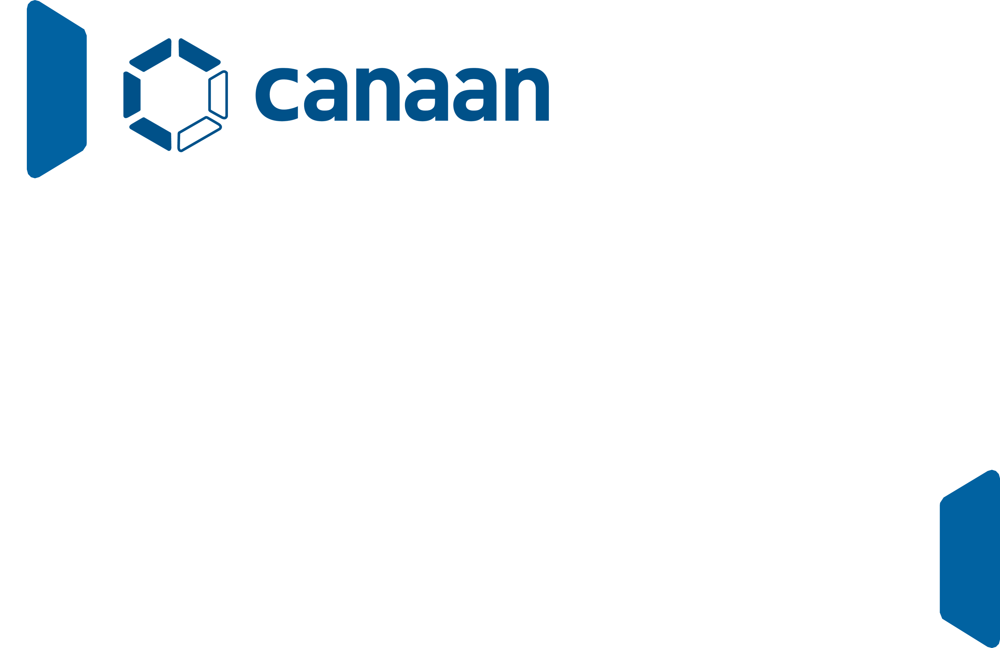
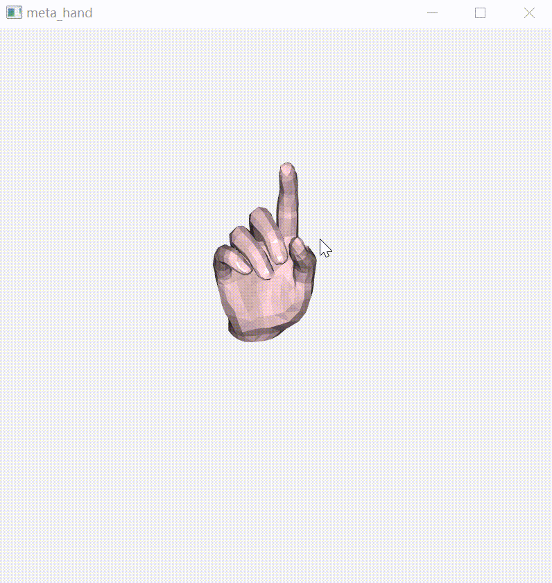
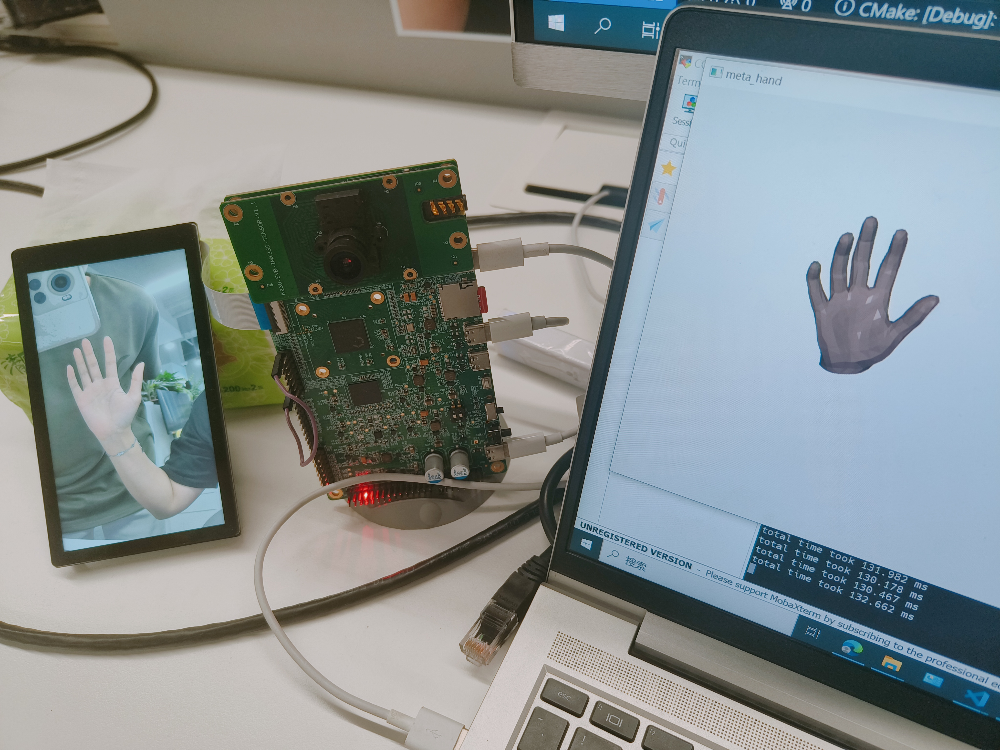

# K230 手势渲染POC

Document version: V1.0 Release date: 2023-9-1
## 介绍
该项目为K230手势渲染POC开源工程，本工程基于K230融合了手部动作捕捉、手部3D mesh模型（MANO模型）等技术。本应用可以手部动作捕捉以及渲染，即K230作为client端摄取真人手部动作，通过在K230上的模型inference和post-process，再将结果传输给作为server端的PC，驱动MANO模型动起来。
## 主要特点

- 实时、无延迟
​    
支持在k230小核端实时与pc通讯
支持在k230大核端快速运行模型

- 动作精准捕捉
​    
支持在k230大核端模型正确推理，推理结果传输至pc，并精准渲染

## 环境准备
    #######download.sh########
    for file in inference_server.dist_v1.0.7z;  
    do  
    wget https://ai.b-bug.org/k230/downloads/fancy_poc/meta_hand/$file || wget https://kendryte-download.canaan-creative.com/k230/downloads/fancy_poc/meta_hand/$file;  
    done  
    
    for file in onboard_v2.3.zip
    do
    wget https://ai.b-bug.org/k230/downloads/fancy_poc/meta_hand/k230_board/$file || wget https://kendryte-download.canaan-creative.com/k230/downloads/fancy_poc/meta_hand/k230_board/$file;  
    done

## 服务端准备

### 1.准备服务端运行环境

    #解压inference_server.dist_v1.0.7z即可

## 客户端准备

### 1. 源码编译

在k230 docker中在src/reference/fancy_poc目录下执行./build_app.sh，得到编译后的 meta_hand.elf以及connect

### 2.在k230上创建meta_hand工程

    运行download.sh下载gaussian.bin、对应的kmodel等文件
    cd /sharefs
    mkdir meta_hand
    ##将需要的文件拷贝到meta_hand目录下，如编译的meta_hand.elf、connect、download.sh下载的gaussian.bin、对应的kmodel等文件

**注意：** sharefs下的文件结构可以参考download下载的onboard文件夹内文件

## 程序运行

### 1. 服务端：

    cd inference_server.dist_v1.0
    start inference_server.exe --ip 192.168.1.2 --port 8080 --RGB 0.76 0.64 0.64

**注意：** 服务端服务ip为运行服务器的本地ip，连接端口默认为8080，RGB为渲染的手部颜色。可自行修改。

### 2. K230客户端

    cd /sharefs/meta_hand
    #小核下执行（./connect.sh）
    ./connect 192.168.1.2 8080 10000
    #大核下执行（./meta_hand_isp.sh）
    ./meta_hand.elf hand_det.kmodel None 0.15 0.4 handkp_det.kmodel e3d.kmodel 10000 0

**注意：** 使用./connect.sh命令时需要在connect.sh中配置相应的通讯端口及ip、buffer_size。buffer_size表示k230大核运行最多保存的bin文件个数。

## 结果展示
### 服务器端渲染效果

### k230屏幕显示和服务器端显示

**注意：** 使用时手距离摄像头不宜过近，不宜用手部侧面和背面做渲染。正确使用方式请参考上图。本应用仅提供一个示例实现，如需更高精度或更优体验，可通过调整阈值或自行替换相应的模型文件。