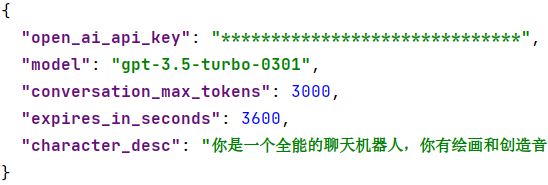
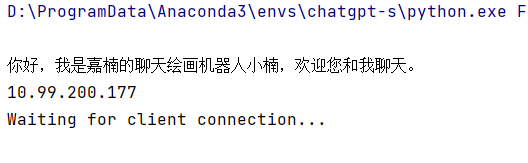

## K230 多模态聊天机器人POC

Document version: V1.0 Release date: 2023-7-17

## 介绍

该项目为K230多模态聊天机器人POC开源工程，本工程基于chatgpt、pytorch融合了文本内容交互、stable diffusion图像生成、Audio LM声音生成等多项技术。能够让用户在K230计算资源上轻松的与chatgpt进行交互，通过与chatgpt聊天实现文本交互、目标图像生成以及目标声音生成。

### 主要特点

* chatgpt文本交互

​		支持用户在k230小核端正常与chatgpt文字聊天

* chatgpt任务理解

​		当用户发送'帮我生成宇航员在埃及骑马'或者’一只可爱的水獭在彩虹漩涡中拿着贝壳，水彩‘等绘画意图命令时，程序会进入绘画模式为用户制作目标图片；

​		当用户发送’帮我制作一首交响乐，宏伟大气‘或者’帮我生成一段鸭子嘎嘎嘎叫的声音‘等音频生成意图时，程序会进入音频生成模式为用户制作目标音频。

* Stable Diffusion图像生成

​		程序会根据用户输入如'帮我生成宇航员在埃及骑马'、’一只可爱的水獭在彩虹漩涡中拿着贝壳，水彩‘或者‘展开想象力，帮我画一幅唐老鸭在宇宙中的画’生成指定的图片：

最终生成的图片会在K230屏幕上显示。

* AudioLM声音生成

程序会根据用户输入如’帮我制作一首交响乐，宏伟大气‘或者’帮我生成一段鸭子嘎嘎嘎叫的声音‘生成声音，最终生成的声音将会使用K230喇叭输出。

音频提示词示例：

1、’帮我生成一首悲伤的音乐‘ 

<audio controls>   <source src="./resource/example_audios/悲伤.wav" type="audio/wav"> </audio>

2、’帮我生成一首萨克斯为主的音乐‘

<audio controls>   <source src="./resource/example_audios/萨克斯.wav" type="audio/wav"> </audio>

3、‘帮我生成一首以鼓和电子琴为主要乐器的轻快的音乐’

<audio controls>   <source src="./resource/example_audios/合奏.wav" type="audio/wav"> </audio>

4、’帮我生成一段动感十足的合奏音乐‘

<audio controls>   <source src="./resource/example_audios/鼓和电子琴.wav" type="audio/wav"> </audio>

5、‘帮我生成一段鸭子嘎嘎嘎叫声’

<audio controls>   <source src="./resource/example_audios/鸭子叫.wav" type="audio/wav"> </audio>

6、‘以两岸猿声啼不住，轻舟已过万重山为题创作一段声音’

<audio controls>   <source src="./resource/example_audios/两岸猿声啼不住.wav" type="audio/wav"> </audio>

7、‘生成一首雄伟大气的交响乐’

<audio controls>   <source src="./resource/example_audios/弦乐.wav" type="audio/wav"> </audio>

## 服务端准备

### 1. 下载服务端源码

- git clone本项目到本地服务器

### 2.在准备服务端运行环境

* conda create -n chatgpt-s python=3.8
* cd multimodal_chat_robot_server
* pip install requirements.txt

### 3. 配置openai api key

* cd  multimodal_chat_robot_server
* 打开config.json，输入openai api key

### 4.下载模型

* 运行src目录下的download.sh脚本，下载model_sd_v1.0.zip压缩包并将其解压，放置在Multimodal_Chat_Robot_Server目录下（model_sd）

### 5. 启动服务

* 在multimodal_chat_robot_server目录下执行python app.py即可开启服务端程序

**注意：**服务端服务ip为运行服务器的本地ip，连接端口默认为8080，如果需要更改的话请在channel/Client_Server/Client_Server_K230.py中的startup函数中进行更改

## 客户端准备

* 在k230 docker中进入到/mnt/src/reference/fancy_poc/目录下，
* 然后执行./build_app.sh，将会在/mnt/src/reference/fancy_poc/k230_bin/目录下生成相应的可执行文件**socket_gpt_image_audo**和**AIOT_GPT.elf**
* 进入到开发板环境后将/dev/mmcblk0p1（linux文件系统）挂载到/sharefs下
* 在k230开发板的sharefs目录下创建Multimodal_Chat_Robot目录mkdir Multimodal_Chat_Robot
* 拷贝**socket_gpt_image_audo**和**AIOT_GPT.elf**到k230开发板sharefs目录下
* 拷贝fancy_poc中的run.sh脚本拷贝到Multimodal_Chat_Robot下
* 在Multimodal_Chat_Robot目录下创建临时文件，执行touch received_image.jpg、touch audio.wav、touch param.txt

## 程序运行

### 1. 服务端：

* cd Multimodal_Chat_Robot
* conda activate chatgpt-s
* python app.py

### 2. K230客户端

* cd /sharefs/Multimodal_Chat_Robot
* 大核下执行./AIOT_GPT.elf
* 小核下执行sh ./run.sh

执行完毕后可以在小核下与chatgpt进行交互

**注意：**使用sh run.sh命令时需要在run.sh中配置相应的通讯端口及ip，如果不想使用sh方式执行，可在终端下执行./socket_gpt_image_audio < port > < ip_address > 例如：./socket_gpt_image_audio 8080 192.168.1.1

